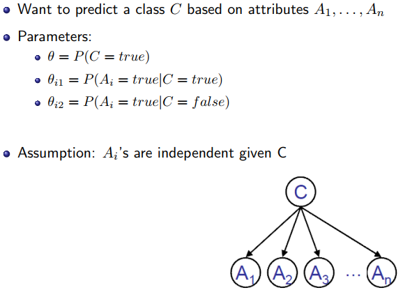

## ML

+ 学习分类
  + 基于观测和规律性的学习：暴力
    +  最近邻学习
    + 神经网络
    + Boosting算法
  + 基于约束的学习
    + 一次性学习
    + 基于解释的学习
+ ML学习任务
  + 有监督
  + 无监督
  + 强化学习：根据奖惩
+ 最近邻学习
  + 见模式识别
+ 决策树学习
  + 相关基本概念
    + 节点：标识属性
    + 边：标识属性值
    + 叶子：标识输出值
  + 决策树可以表示为析取式的合取
  + 想法：选择最重要的属性作为根，尽可能分子集为正例和负例，即信息熵最小，这样能获得一棵较小的树
  + 量化：计算信息增益（ID3），计算增益率（C4.5）
    + $B(q)=-(qlog_2q+(1-q)log_2(1-q))$（布尔变量时）
  + 过拟合
    + 泛化能力
    + 噪声、训练集太小
    + 解决办法：剪枝，删去不明显相关的节点
+ 贝叶斯学习
  + H：假设
  + $P(H|d)=\alpha P(d|H)P(H)$
  + 贝叶斯分类
    + 不会发生过拟合：所有假设都被考虑
    + 复杂度高
    + 解决方案：最大化贝叶斯学习
  + MAP（极大后验）：数据下条件概率最大的假设$h_{MAP}=argmax_{h_i}P(h_i|d)=argmax_{h_i}P(h_i)P(d|h_i),P(X|d)\approx P(X|h_{MAP})$
    + 取log优化计算
  + ML（极大似然）：每种假设先验概率一样$h_{ML}=argmax_{h_i}P(d|h_i),P(X|d)\approx P(X|h_{ML})$
    + 计算：求导得$\theta_i=\frac{c_i}{c_i+l_i}$
    + 即最合理的假设恰好是其标签占比
    + 拉普拉斯光滑，"0"数据问题，每种类别+1
  + 贝叶斯分类，MAP，ML随着数据增加结果会交汇
  + 朴素贝叶斯
    + 
+ k均值聚类
  + 初始分类不一样，最后的分类可能不一样
+ EM算法：从不完备的数据中学习