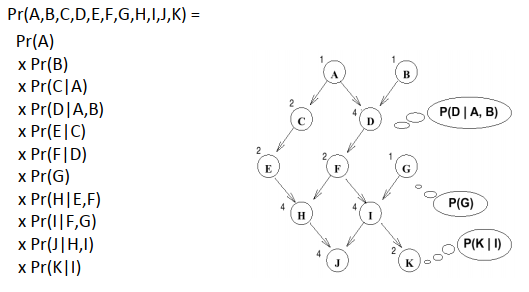
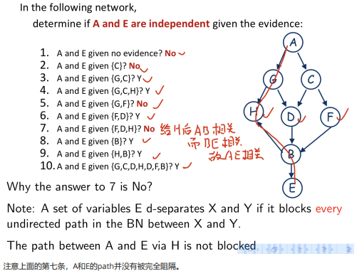

## 不确定推理

+ 不确定

  + 初始状态
  + 行动效果

+ 事件，域，原子事件

+ 问题：指数增长；解决：利用独立性，尤其是条件独立性

$$
Pr(A)=\sum\limits_{i=1}^{k}Pr(A\cap B_i)=\sum\limits_{i=1}^{k}Pr(A|B_i)Pr(B_i)
$$

+ （事件）独立性：$A$与$B$独立$\Leftrightarrow Pr(B|A)=Pr(B)$

  + $Pr(A\cap B)=Pr(A)·Pr(B)$

+ 条件独立性：$B$和$C$在条件$A$下独立$\Leftrightarrow Pr(B|A\cap C)=Pr(B|A)$

  + $Pr(B\cap C|A)=Pr(B|A)·Pr(C|A)$

+ 贝叶斯定理：容易观察$\rightarrow$不容易观察

$$
Pr(Y|X)=\frac{Pr(X|Y)Pr(Y)}{Pr(X)}
$$

+ 链式法则

$$
Pr(\bigcap\limits_{i=1}^{n}A_i)=\prod\limits_{i=1}^{n-1}Pr(A_i|\bigcap\limits_{j=i+1}^{n}A_j)
$$

+ 变量独立性：变量域内的若干个事件都有独立性
  
  + $Pr(X|Y)$是二元函数$\leftrightarrow Pr(A|B)$是一个值
  
+ 变量独立：计算复杂度变为线性
  
  + 条件独立：变为多项式
  
+ 贝叶斯网络：图+表
  + 有向无环图，节点为变量
  + 条件概率表：节点的父亲给定时，孩子的条件概率

  + 注意下图中都是变量

    

  + 构造

    + 应用链式法则
    + 移除各乘数的无关变量
    + 建立图
    + 建立条件概率表（这里变量需要实例化，bool值则只需要记录为true情况）
    + 基于因果关系，经验和概念建构造一般都是较好的

  + （直觉上的结论）贝叶斯推断：给定所有父亲，后代和祖先是条件独立的（其实是下图一）

  + D-分离

    + 
    + 
  
+ 贝叶斯推理：在一定条件集（可以为$\emptyset$）下计算概率分布$Pr(Q|E)$，其余变量为$Z$

  + 不希望出现指数复杂性$2^{n-k}$(bool时)
  + 变量消除算法
    + DP
    + 需要尽可能先除去无关变量
    + 由外往内计算函数，函数变量逐渐被消除
    + 变量表大小：指数级
    + 因子：本质上是一个概率表
    + 因子的积（类似自然连接）：$h=f\times g\\ H(X,Y,Z)=f(X,Y)\times g(Y,Z)$
    + 因子的和：$h(Y)=\sum_Xf(X,Y)$
    + 因子的限制：$h(Y)=f_{X=a}=f(a,Y)$
  + 分析复杂性
      + $w$是中间表最大度，$2^{O(w)},w<<n,e.g.w=10,n=1000$
  + 是桶删除框架（DP的拓展）的一个特例

+ 相关：给定E查询Q
  
    + Q自己是相关的
    + 相关节点的祖先是相关的
    + 若e是相关变量的后代，其是相关的
    + 有可能过度估计，可能把不相关变量当成相关的，不可能把相关变量当成不相关的。
    + 用于在VE前删去无关变量
    
+ 超图、超边（可以连接多个节点）
  
    + 贝叶斯网络可以看作超图
    + 每个家庭就是一条超边
    + 消除节点$\to$变量消除
    + 删除宽度：最大的超边长度
    + 树宽$w$：所有可能的删除顺序中最小的删除宽度，NP难
    
+ 多形树：无环
    + 优先删除单一连接
    + 启发式方法：每次删除使产生因子规模最小的节点
    + 树宽：所有节点中父节点的最大数目
    
+ VE顺序

    + 优先删除单一连接
    + Min-Fill，总是删除接下来创建最小大小因子的变量
    + 优先删除权重最小的变量
    + 优先删除邻居最少的节点的变量

