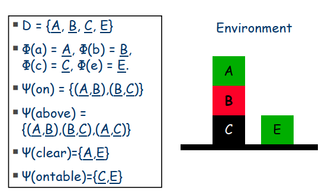
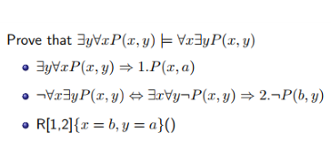
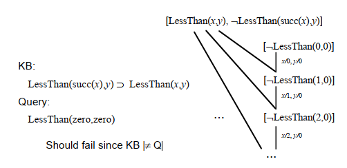

## 知识表示和推理KRR&&一阶逻辑FOL

+ 问题产生：计算积分
+ 解决方案：目标树（goal tree // and/or tree）+ 积分表 + 安全变换 + 启发式变换
+ 新问题：搬箱子问题
	+ WHY：目标树的父结点
	+ HOW：目标树的子树
+ 问题复杂度=max(程序复杂度，环境复杂度）
+ 知识工程 基于规则的专家系统 前向链 后向链
+ 规则和常识之间没有任何关系
  + 名著拆解
+ 所有人工智能系统都是基于知识的
  +  这里只讨论一阶逻辑
+ 一些基础概念：变量、谓词、项、量词、解释、蕴含
  + 符号标记：谓词大写开头，函数小写开头
  + 谓词：表示个体词性质或相互之间关系的词
  + 函数
  + 0变量谓词：命题
  + 0变量函数：常量
  + 所有变量值都是项
  + 所有变量都是项的函数也是项
  + （原子）公式：所有变量都是项的谓词
  + 若$\alpha$和$\beta$是公式，$v$是变量，则$\forall v,\alpha$是公式
  + 语句：没有变量的公式，（类似公式？）
  + 替代$\alpha[v/t]$：$v$替代所有$\alpha$中的$t$
  + 解释（环境？）$\xi=<D,I>$：
     + $D$是非空域
     + $I$可以是从$n$元谓词到$D^n$的映射，即$I(P)\subseteq D^n$
     + e.g.$p$是$0$元谓词，即公式，则$I(p)\in\{true,false\}$
     + $I$可以是从$n$元函数到$D$的映射，即$I(f):D^n\rightarrow D$
     + e.g.$c$是$0$元函数，即常量，则$I(c)\in D$
     + 
  + 项的符号标记
     +  域$D$内元素都是项
     +  变量赋值$\mu$是从变量到域$D$的映射
     +  $||v||_{\xi,\mu}=\mu(v),||f(t_1,...,t_n)||_{\xi,\mu}=I(f)(||t_1||_{\xi,\mu},...,||t_n||_{\xi,mu})$
  + 可满足性satisfacton：$\xi,\mu\models\alpha$，$\xi,\mu$满足$\alpha$
    + $\xi,\mu\models P(t_1,...,t_n)\Leftrightarrow <||t_1||_{\xi,\mu},...,||t_n||_{\xi,\mu}>\in I(P)$
  + 回顾推理规则
    + 假言推理：$(\phi\rightarrow\Phi)\models(\phi\models\Phi)$
    + 假言三段论：$(\phi\rightarrow\Phi,\Phi\rightarrow\eta)\models(\phi\rightarrow\eta)$
    + 析取三段论：$(\phi\or\Phi,\neg\phi)\models\phi$
    + 全程实例化，存在一般化
    + ...
+ 以蕴含为基础的推理过程
  + 文字：原子公式及其非
  + 子句：文字的合取
  + 标准形式：子句的析取
  + 归结$(\{p\}\cup c_1)\cap(\{\neg p\}\cup c_2)\models c_1\cup c_2$
  + 空子句()
+ 派生/推理$S\vdash c\Leftrightarrow c\in S\or c是两个子句归结的结果$
  + $S\vdash c\Rightarrow S\models c$，反之不成立
  + 推理和蕴含的区别：推理需要目标子句的形式都可以通过$S$通过归结得出，而蕴含只要求$S$为真时，目标子句也为真。
  + $S\vdash()\Leftrightarrow S\models()\Leftrightarrow S$是不可满足的
  + $KB\models\alpha\Leftrightarrow KB\and\neg\alpha$不可满足，因此令$S$为KB和$\neg\alpha$，查看是否$S\vdash()$
  + 斯克林正则化：将一阶逻辑公式转化为标准子句形式
    + 消去$\rightarrow$，利用$A\Leftrightarrow\neg A\or B$
    + 将$\neg$变换放入最内层文字
    + 全称存在标准化，把不相关但同名的换成不同名字
    + 除去存在量词，通过引入函数（注意外层的全称量词）
    + 把全称量词移到最外层
    + 子句规范化，把析取从内层提到外层
    + 拆开嵌套析取合取式
    + 把全称符号丢去，把子句拆开，此时子句仅有$\neg,\or,$谓词和函数，所有变量都是全局全称变量
+ 合一Unifiers：让联系的文字相消但不能过度特殊化，通过变量替代实现
    + e.g.$P(x,g(y,z))\{x=y,y=f(a)\}\Rightarrow P(y,g(f(a),z))$
    + 组合替代：没学会
    + MGU(Most Gereral Unifier)：用最不特殊的方法让原子公式匹配
      + 若两个子句可以合一，则MGU唯一
+ 归结：利用合一处理标准子句形式
    + 
+ 答案提取：增加子句answer(x)  ，最后归结得answer(someone)即说明someone为答案
+ 一阶逻辑归结的问题：只能推出不满足的，若子句集合是可满足的可能无法终止
    + 
+ FOL
    + 见上基础概念部分
    + 公式证明参考离散数学
+ 一阶逻辑和高阶逻辑
    + 一阶逻辑谓词的参数是常量，变元或函数
    + 二阶逻辑谓词参数本身是一个一阶谓词
    + 以此类推