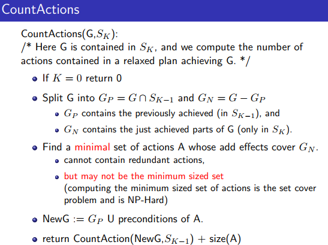

## 规划

+ 情景演算：和KRR不同的是现在的环境是动态的，AI需要act
  + 经典规划：精确的初始状态&行动影响确定
  + 不确定规划：此章不涉及
+ 一阶逻辑表示动态环境
  + 行动：前提$\to$效果
  + 情景：可能的行动的记录
    + 注意情景和状态的不同，从回退操作可以看出两者不同
    + $S_0$：初始情景，当前没有行动
    + 特殊的函数do(a,s)表示情景s采取行动a后的新情景
  + 流：随情景改变的谓词或函数
    + 最后一个参数是情景
+ 规划生成：依然是归结
  + 类似“推理”地，查询，行动变子句
  + 时间投影：预测给定的一系列动作的效果
  + 规划合成：计算达到目标的一系列动作
  + 问题：行动不影响的子句很多，需要非显示的表示
    + 解决方案：只显示写出真的子句，但是规划生成很慢
+ 问题简化
  + 经典规划
  + 封闭世界假设CWA：CW-KB像数据库一样表示KB
    + KB中的所有常量是域对象的？
    + 非真即假
+ STRIPS(Stanford Research Institute Problem Solver)：是一种规划器，也指其形式化输入语言
  + STRIPS的行动表示更新CW-KB
    + 前提：必须是原子的
    + 效果：增加，删除
    + pickup(x)是一个STRIPS运算符，实例化后的pickup(a)是一个行动
  + 和情景演算的区别
    + STRIPS拥有完整的信息（由CW-KB给出）；情景演算没有
    + STRIPS中两种状态由两个数据库表示；情景演算中两种状态可能出现在一个子句里
  + STRIPS没有条件效果
    + 可能需要额外的动作来表示条件
+ ADL(Action Description Language)
  + 前提可以是公式
  + 可以有条件和全局效果
+ Search：规划生成搜索树
  + 树很大

  + 启发式搜索
    + 考虑松弛问题：忽略行动的DEL
    + 域相关
    + h为松弛问题中到达目标的行动数
    
  + 算法：可达性分析(Reachability analysis)
    + 轮流处理状态和行动层
    + 寻找所有前提在$S_0$中的行动集$A_0$，一般来说，$A_i$的元素不在$A_{i-1}$中
    + $S_i=S_{i-1}\cup A_{i-1}$添加的事实
    + 循环往复，直至到达目标或状态不再变化
    
  + 算法：CountActions 

    + 在可达的前提下计算步长，即启发式h

    

    + 相关：集合覆盖问题，NP难
    + 该算法并没有获得最好步长，只实现了集合覆盖，不一定有最小；即使都是最小的，也不一定是最优的，因为行动会影响下一阶段的前提
    + 该算法不是可满足的，但经验主义地表现良好

